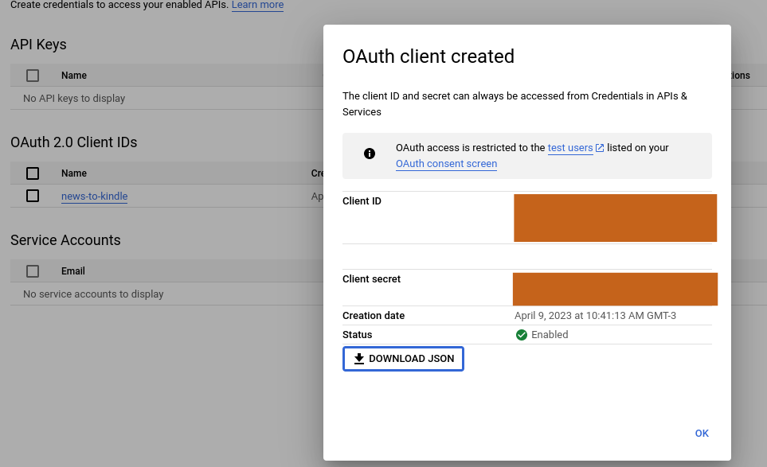

# News/Articles to Kindle

- [News/Articles to Kindle](#newsarticles-to-kindle)
- [Introduction](#introduction)
- [Setup](#setup)
  - [Clone this repository](#clone-this-repository)
  - [Credentials (authenticate required)](#credentials-authenticate-required)
  - [Kindle email and .env file](#kindle-email-and-env-file)
  - [Dependencies](#dependencies)
- [Running the script](#running-the-script)
- [TODO](#todo)

# Introduction

Repository to store an application using Python to web scrapping news/articles from sites, transform in an epub format and send via email to a Kindle for reading.


Source: Photo by <a href="https://unsplash.com/@obionyeador?utm_source=unsplash&utm_medium=referral&utm_content=creditCopyText">Obi - @pixel7propix</a> on <a href="https://unsplash.com/photos/UEQvUtRs224?utm_source=unsplash&utm_medium=referral&utm_content=creditCopyText">Unsplash</a>

---

# Setup

## Clone this repository

Firstly, we need to clone this repository

```bash
$ git clone https://github.com/BrenoAV/articles-to-kindle.git && cd news-to-kindle/
```

## Credentials (authenticate required)

1. Go to [https://console.cloud.google.com/apis/dashboard](https://console.cloud.google.com/apis/dashboard) and create a new project


2. Now, we need to enable the Google Gmail API. Search for Gmail API and turn on


3. After to enable, we can create now our credentials using Oauth 2.0. For that, click on `Credentials` &rarr; `Create Credentials` &rarr; `OAuth client ID`


- To create an OAuth client ID, you must first configure your consent screen. Click on create, select `external`, fill the mandatory forms: `App Name`, `User support email`, and `Developer contact information`

4. Return to the Credentials tab and create now the OAuth client ID, and select Desktop application.


Type a name for your OAuth client and click on create button.

5. Click on `download json` and save it with the name `credentials.json`



## Kindle email and .env file

 - You need to have your Kindle email. This is a tutorial if you don't know your email: [https://www.lifewire.com/find-kindle-email-address-5271915](https://www.lifewire.com/find-kindle-email-address-5271915). Remember that you need to allow your email to send for your Kindle &rarr; [Add an Email Address to Receive Documents in Your Kindle Library](https://www.amazon.com/gp/help/customer/display.html?nodeId=GX9XLEVV8G4DB28H)

- Create a `.env` file with the following content, where your have to put yours emails in the fields:

```
# .env file
OUR_EMAIL = "youremail@gmail.com"
KINDLE_EMAIL = "yourkindleemail@kindle.com"
```

## Dependencies

- We need to install python's necessary dependencies:

```bash
$ pip install google-api-python-client google-auth-httplib2 google-auth-oauthlib pypandoc beautifulsoup4 PyYAML python-dotenv
```

- We need to have pandoc installed in our system. This is a tutorial if you don't have yet: [https://pandoc.org/installing.html](https://pandoc.org/installing.html)

- I ran this in a python environment using Debian Testing and python==3.11.2

# Running the script

1. After all the setup part you can now run: `$ python main.py` and will open the GUI of the program


2. Type link of the articles that you want to send for you kindle from https://www.bbc.com/future/ . I'll take this article here: https://www.bbc.com/future/article/20230405-why-ai-is-becoming-impossible-for-humans-to-understand
   - **For now, just work with the [BBC Future](https://www.bbc.com/future/) (it's a good site to read and practice English reading skills)**
   - It's allow getting from this endpoint as you can see on https://www.bbc.com/robots.txt

3. Click on the button `Send article to Kindle`, and it'll prompt a window on your browser to authenticate. Click on the button `Continue`


- This process when succeeded returns a response in the browser with the following text: "The authentication flow has completed. You may close this window."

4. You'll receive the article in epub format in your Kindle. For me:


# TODO

- [ ] Document the code (functions)
- [ ] Add others sources of obtain news or articles
- [ ] Improve the GUI with some errors if you put some invalid option or if the authenticate process fails
- [ ] Add in the GUI to insert the emails instead of create a .env file